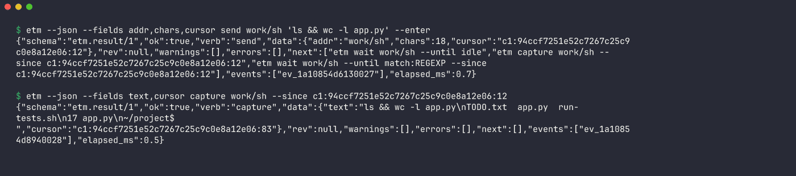
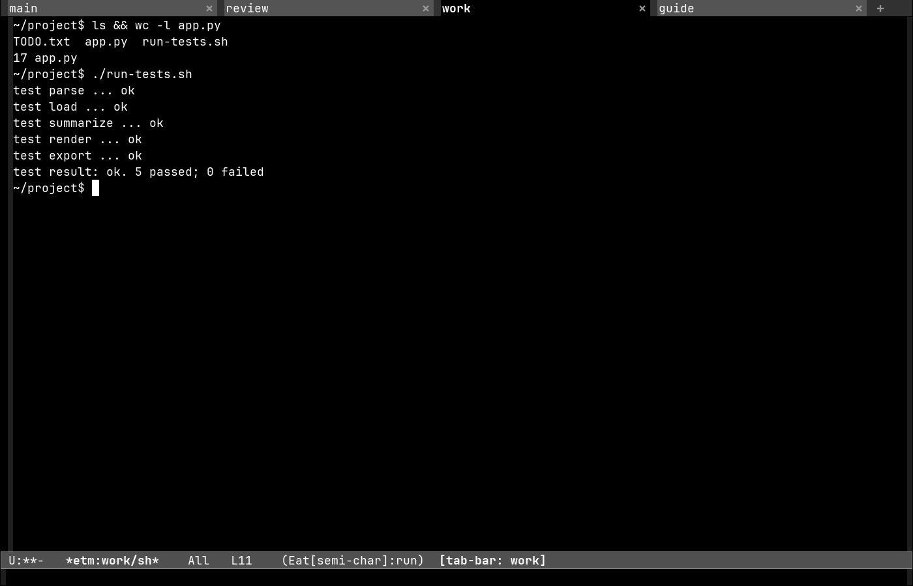
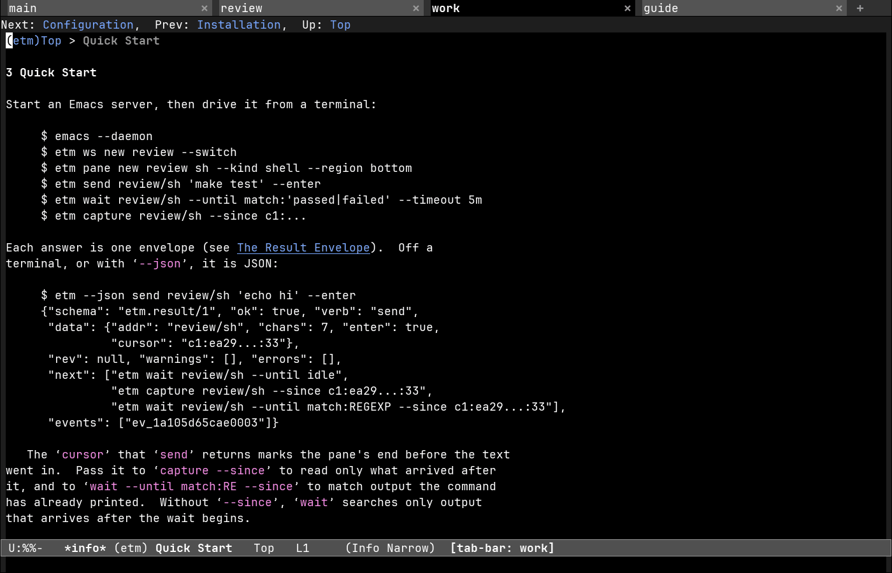

# etm: Emacs Terminal Manager

Drive a running Emacs from outside: its workspaces, panes and terminals,
as a closed set of JSON verbs. Think `ntm` / `tmux` robot mode, for Emacs.

> Status: pre-release (0.1.0). Not published yet.

The full manual is `docs/etm.texi`, an Info manual: `info etm`, or
`C-h i m etm` in Emacs once it is installed (MELPA and `package-vc-install`
build it; see [Install](#install)). This README mirrors its overview and
quick start.

## Screenshots

Real renders of a plain `emacs -Q` driven by the `etm` CLI, on synthetic
demo data.








More, one per feature and workspace backend, with the command that produced
each: [docs/showcase.md](docs/showcase.md).

## Overview

An agent, a script, or you at a shell names a verb; Emacs answers with one
JSON envelope and a stable exit code. Two halves:

- **The `etm` CLI (Rust, this crate).** Parses argv into a request,
  base64-wraps it (nothing is ever quoted as an Emacs Lisp string) and
  speaks the Emacs server socket protocol directly (what `emacsclient`
  speaks), falling back to `emacsclient --eval`. A snapshot round trip
  takes about a millisecond.
- **The `etm` Emacs package (`lisp/`).** One entry point,
  `(etm-rpc REQUEST-BASE64)`, dispatching a closed verb table. Loads in
  `emacs -Q`; needs Emacs 29.1 or newer.

A **workspace** is whatever the active backend calls one (a persp-mode
perspective, a tabspaces or tab-bar tab, or the one `global` workspace of
a session without any). A **pane** is a buffer-shaped resource of one
workspace (a shell, a running command, a file, a directory tree, a named
page), addressed `<workspace>/<pane-key>`; buffer names are only labels.
The verb table is closed: an unknown verb is a typed usage error, never an
evaluation, and `eval` is the one logged escape hatch. Every envelope
carries `next`, the commands that most plausibly follow, and cites the
event the call left in Emacs.

## Quick start

Start an Emacs server, then drive it from a terminal:

```console
$ emacs --daemon
$ etm ws new review --switch
$ etm pane new review sh --kind shell --region bottom
$ etm send review/sh 'make test' --enter
$ etm wait review/sh --until match:'passed\|failed' --timeout 5m
$ etm capture review/sh --since c1:…
```

Each answer is one envelope. Off a terminal, or with `--json`, it is JSON:

```json
{"schema": "etm.result/1", "ok": true, "verb": "send",
 "data": {"addr": "review/sh", "chars": 7, "enter": true, "cursor": "c1:ea29…:33"},
 "rev": null, "warnings": [], "errors": [],
 "next": ["etm wait review/sh --until idle",
          "etm capture review/sh --since c1:ea29…:33",
          "etm wait review/sh --until match:REGEXP --since c1:ea29…:33"],
 "events": ["ev_1a105d65cae0003"]}
```

The `cursor` `send` returns marks the pane's end before the text went in:
pass it to `capture --since` to read only what arrived after it, and to
`wait --until match:RE --since` to match output the command has already
printed. `RE` is an Emacs regexp: alternation is `\|` (a bare `|` is
literal). A `global` workspace always exists, so the shortest session needs
none:

```console
$ etm pane new global sh --kind shell
$ etm send global/sh 'ls' --enter
$ etm capture global/sh --lines 20
```

`etm capabilities` says what this Emacs supports; `etm doctor` is the
first stop when something looks wrong.

Exit codes: 0 ok, 1 failure, 2 usage, 3 not found, 4 rev conflict,
5 Emacs unreachable, 6 partial apply, 7 wait timeout.

## Install

```sh
cargo install etm                 # the CLI (bundles the elisp)
etm install-elisp ~/.emacs.d/etm  # optional: put the package on disk
```

The Emacs package, with this manual, from MELPA (`M-x package-install RET
etm`; recipe `(etm :fetcher github :repo "davidawad/etm" :files (:defaults
"docs/etm.texi"))`), or straight from the repository:

```elisp
;; Emacs 29.1+
(package-vc-install
 '(etm :url "https://github.com/davidawad/etm" :lisp-dir "lisp" :doc "docs/etm.texi"))
;; straight.el
(straight-use-package
 '(etm :host github :repo "davidawad/etm" :files ("lisp/*.el" "docs/etm.texi")))
```

You do not have to install the elisp: when the target Emacs has not loaded
etm, the CLI loads it, from the first of

1. `--rpc-el PATH` (etm.el, its directory, or your config that loads it),
2. `$ETM_RPC_EL`,
3. the server's own installation, `(locate-library "etm")`,
4. the copy bundled in the binary (written to `~/.cache/etm/lisp-VERSION-HASH/`).

`--no-autoload` never loads anything. Emacs must run a server
(`M-x server-start` or `emacs --daemon`); pick it with `--socket NAME|PATH`.

## Verbs

```
etm snapshot [--fields a,b]           whole session in one read
etm capabilities | doctor | events [--since T]
etm ws   ls | get [W] | new W [--subject S] [--switch] | switch W | rename W NAME | kill W
etm pane ls [W|--all] | new W KEY --kind shell|cmd|editor|tree|page [--region R] | kill ADDR | focus ADDR
etm send ADDR TEXT|- [--enter]
etm capture ADDR [--since CURSOR] [--lines N]
etm wait ADDR --until idle|exit|match:RE [--timeout DUR]
etm eval FORM                         escape hatch, logged
etm install-elisp DIR | bench | help
```

A pane is addressed `<workspace>/<pane-key>`. Global output flags:
`--json`, `--robot-format=json|toon|markdown|text`, `--fields`, `--brief`,
`--limit/--offset`, `--dry-run` (see `etm help`, and the manual's "Verb
Reference" and "Global Flags").

## Workspaces

`etm-workspace-backend` (default `auto`) picks what a workspace is:

| backend      | workspace                 | detected when                         |
|--------------|---------------------------|---------------------------------------|
| `persp-mode` | a perspective             | `persp-mode` is on                    |
| `tabspaces`  | a tab with its own buffers| `tabspaces-mode` is on                |
| `tab-bar`    | a tab-bar tab             | `tab-bar-mode` is on, or >1 tab       |
| `single`     | one `global` workspace    | always (create/rename/kill refused)   |

A backend is a set of `cl-defmethod`s on the `etm-backend-*` generics
(list, current, name, id, new, switch, rename, kill, buffers, add-buffer,
parameter, set-parameter); add your own the same way.

## Extension points

All have working defaults; a configuration replaces them:

- `etm-resource-resolver`: pane identity (which buffer is pane KEY of
  workspace W). Default: etm's own registry.
- `etm-layout-dock-function`: how a pane takes a side region. Default:
  `display-buffer-in-side-window`.
- `etm-page-types` (name -> function) and `etm-page-type-functions`: what
  `--kind page --page NAME` shows. Default: also any command named NAME.
- `etm-doctor-functions`, `etm-snapshot-functions`: extra doctor rows and
  snapshot sections.
- `etm-event-log-function`, `etm-event-list-function`, `etm-event-functions`:
  where the per-call events go. Default: a ring in Emacs.
- `etm-tag-parameters`, `etm-persp-id-parameter`: parameter names for the
  tags a controller mounts workspaces with.

## Development

```sh
cargo test                                  # CLI, plus end-to-end against throwaway emacs -Q daemons
lisp/test/run-tests.sh                      # ERT: unit, then each backend in its own daemon
emacs -Q --batch -l lisp/test/etm-lint.el -- lisp/etm*.el   # checkdoc + package-lint
makeinfo --no-split -o docs/etm.info docs/etm.texi           # the manual; CI fails on a warning
```

`lisp/test/test-etm-manual.el` (part of `run-tests.sh unit`) holds the
manual to the code: every option of `defgroup etm` has a `@defopt`, every
verb is documented, and the worked example runs as printed.

## License

MIT, see [LICENSE](LICENSE).
