# etm showcase

Every picture below is a real render, made by
[`docs/showcase/make-screenshots.sh`](showcase/make-screenshots.sh) from a
plain `emacs -Q` (a built-in dark theme, one font, the etm package, the
workspace backend under test and nothing else) on a headless X display, and
the real `etm` binary driving it. The data is synthetic: a made-up
`~/project` of three files. Emacs frames are 1400x900 PNGs exported by
Emacs itself (`x-export-frames`); terminal output is rendered with
[freeze](https://github.com/charmbracelet/freeze). Each section gives the
exact command that produced the state shown.

The mode line of each frame ends with `[backend: workspace]`, a cosmetic
segment from [`docs/showcase/init.el`](showcase/init.el) that names etm's
workspace backend and the current workspace.

- [Snapshot](#snapshot)
- [Workspaces](#workspaces)
- [Panes](#panes)
- [Send and capture](#send-and-capture)
- [Wait](#wait)
- [Doctor](#doctor)
- [Events](#events)
- [Workspace backends](#workspace-backends)
- [Output formats](#output-formats)
- [The manual](#the-manual-in-emacs)
- [Help](#help)
- [Regenerating the images](#regenerating-the-images)

## Snapshot

`etm snapshot` reads the whole session in one call: Emacs, the backend, the
current workspace, every workspace and pane, the windows and the latest
events. Here, trimmed to the interesting keys, and the pane list:

```console
$ etm --json --fields emacs,backend,current,workspaces snapshot
$ etm --json --fields addr,kind,region,mode,running,visible pane ls
```

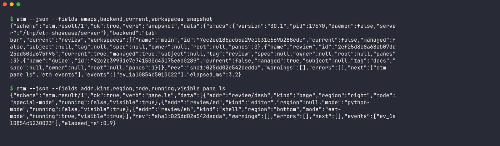

And the Emacs frame that JSON describes: the `review` workspace (the active
tab) with an editor pane, a terminal docked at the bottom and a page docked
at the right.

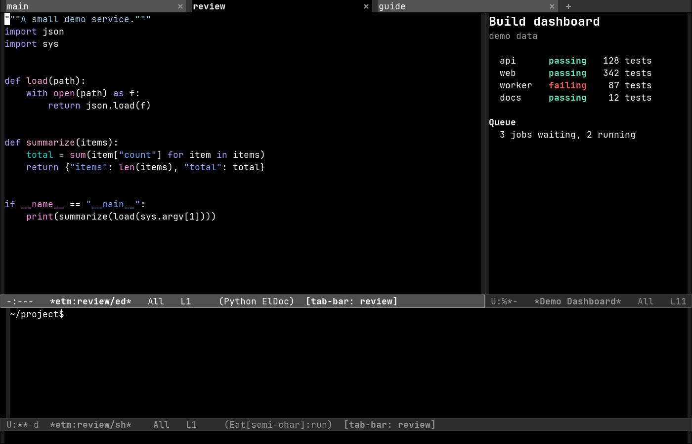

## Workspaces

`ws ls`, `ws new`, `ws switch`, `ws rename` and `ws kill`, in one session on
the `tab-bar` backend (a workspace is a tab):

```console
$ etm --json --fields name,current,panes ws ls
$ etm --json --fields name,current,created ws new review --switch
$ etm --json --fields name,current,created ws new notes
$ etm --json --fields name,current ws switch notes
$ etm --json --fields name,current ws rename notes docs
$ etm --json --fields name,current,panes ws ls
$ etm --json --fields name,killed ws kill docs
```

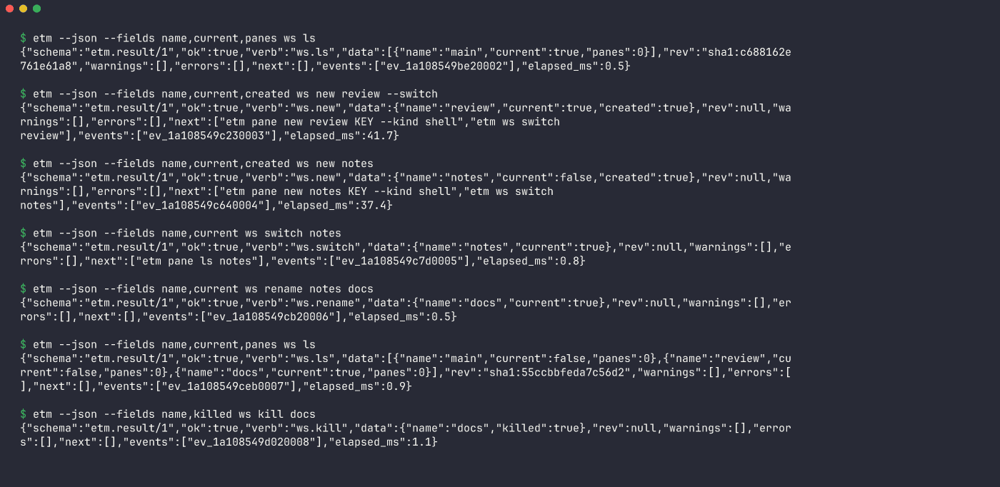

Three workspaces next to `main`, after `etm ws new docs --switch` and
`etm ws new api --switch` (each with a pane), then `etm ws switch review`:

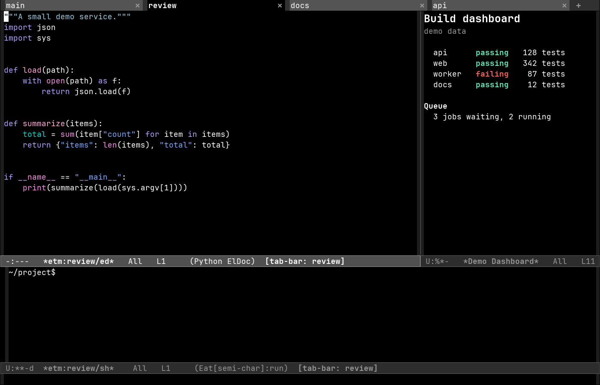

After `etm ws rename docs guide` and `etm ws kill api`, with `guide` shown
(`etm ws switch docs` before the rename); the pane `docs/tree` kept its
place, because pane identity follows the workspace id, not its name:

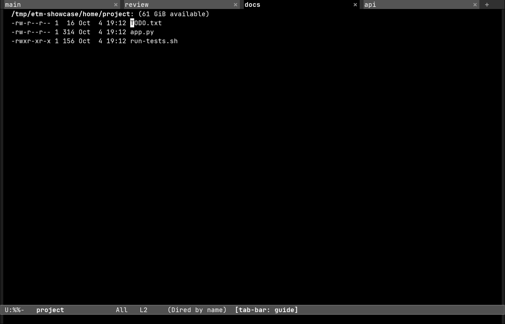

## Panes

`pane new` creates a pane of one kind in a workspace, `--region` docks it
(`bottom`, `right`, `left`), and `pane focus` shows it. One of each of the
common kinds: an `editor` on a file, a `shell` (here an `eat` terminal, via
`--backend eat`) docked at the bottom, and a `page` docked at the right,
a registered demo page type named `dashboard`:

```console
$ etm --json --fields addr,kind,region,mode pane new review ed --kind editor --path ~/project/app.py
$ etm --json --fields addr,kind,region,mode pane focus review/ed
$ etm --json --fields addr,kind,region,mode pane new review sh --kind shell --backend eat --region bottom --path ~/project
$ etm --json --fields addr,kind,region,mode,page_state pane new review dash --kind page --page dashboard --region right
$ etm --json --fields addr,kind,region,mode,visible pane ls
```

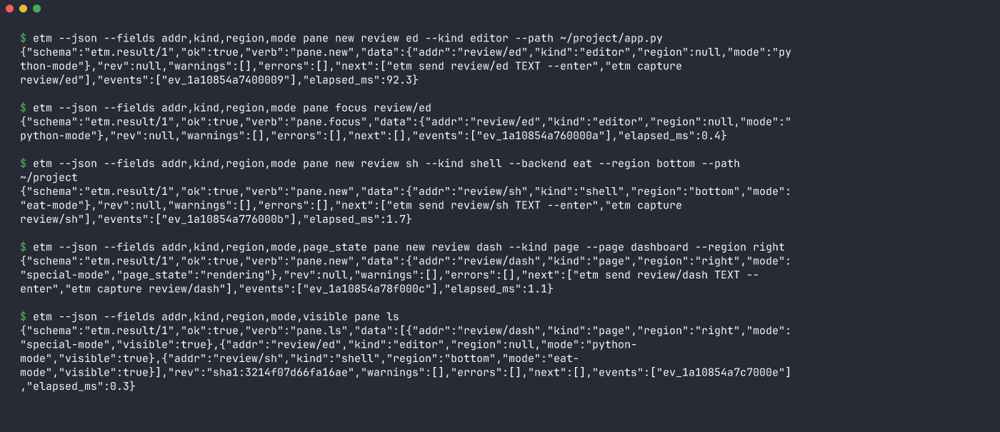

The frame those commands produce:


The other kinds in a `tour` workspace: a `tree` (Dired) docked left, a `cmd`
(a command in comint) and an eshell `shell` docked at the bottom:

```console
$ etm ws new tour --switch
$ etm pane new tour tree --kind tree --path ~/project --region left
$ etm pane new tour log --kind cmd --cmd 'cd ~/project && cat TODO.txt && ls'
$ etm pane focus tour/log
$ etm pane new tour esh --kind shell --region bottom --path ~/project
$ etm send tour/esh 'ls' --enter
```

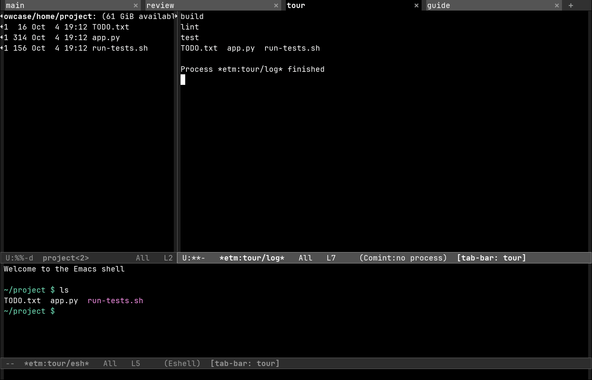

A page type is one line of configuration (the demo's is in
[`docs/showcase/init.el`](showcase/init.el)):

```elisp
(add-to-list 'etm-page-types '("dashboard" . showcase-dashboard))
```

## Send and capture

`send` types into a terminal pane and returns a cursor: the pane's end
before the text went in. `capture --since CURSOR` reads exactly what arrived
after it. The terminal before:

```console
$ etm ws new work --switch
$ etm pane new work sh --kind shell --backend eat --path ~/project
$ etm pane focus work/sh
```

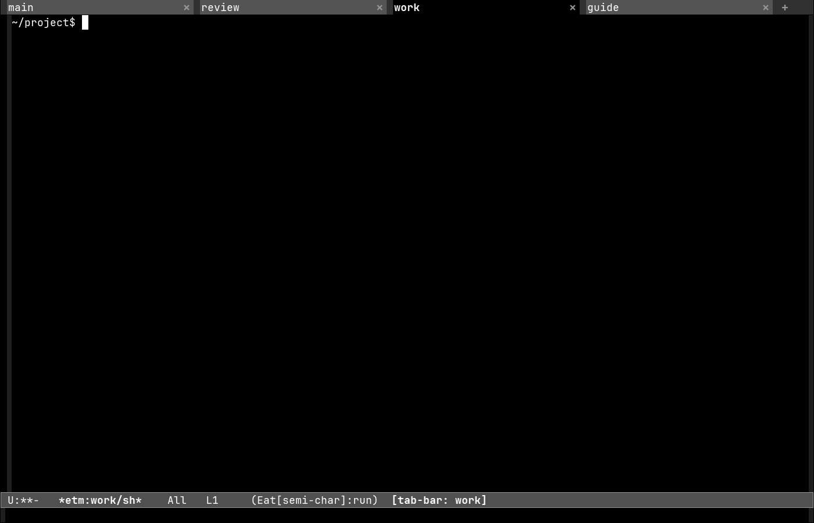

Then, with the cursor `send` returned:

```console
$ etm --json --fields addr,chars,cursor send work/sh 'ls && wc -l app.py' --enter
$ etm --json --fields text,cursor capture work/sh --since c1:…
```


The terminal after:

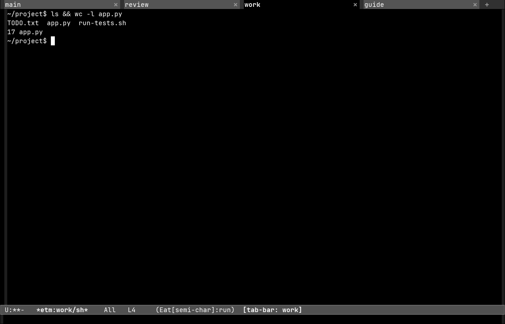

## Wait

`wait --until` blocks until a condition holds: `idle`, `exit`, or
`match:REGEXP` (an Emacs regexp). It matches output that arrives after the
wait begins, or after `--since CURSOR`. The command takes about two seconds
to print its result line:

```console
$ etm --json --fields addr,chars,cursor send work/sh './run-tests.sh' --enter
$ etm --json --fields addr,until,elapsed_ms,match wait work/sh --until match:'test result' --timeout 30s
$ etm --json --fields text capture work/sh --lines 8
```

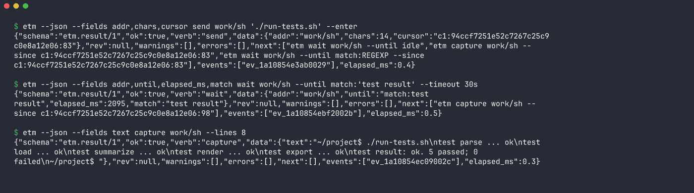


A condition that never holds fails with `wait.timeout` and exit code 7.

## Doctor

`etm doctor` probes etm's own invariants: the server, JSON support, the
workspace backend, that every pane resolves through the registry and that
pages rendered.

```console
$ etm --robot-format=toon --fields healthy,rows doctor
```

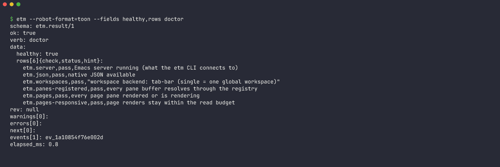

## Events

Every verb leaves an event in Emacs (`etm events` pages through them,
newest last):

```console
$ etm --robot-format=toon events --limit 6
```

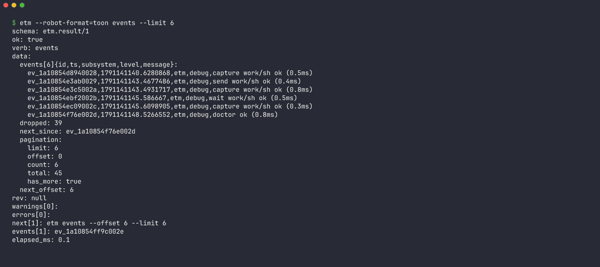

## Workspace backends

`etm-workspace-backend` picks what a workspace is; `auto` (the default)
takes the first available of `persp-mode`, `tabspaces`, `tab-bar`, `single`.
Each frame below is the same three-pane layout (the `pane new` commands of
[Panes](#panes)) on a fresh `emacs -Q` with only that backend enabled; the
mode line names the backend and the workspace.

### persp-mode

A workspace is a perspective.

```console
$ etm --json --fields name,current,panes ws ls
$ etm --json --fields name,current,created ws new review --switch
```

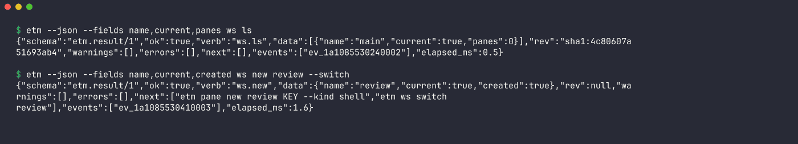
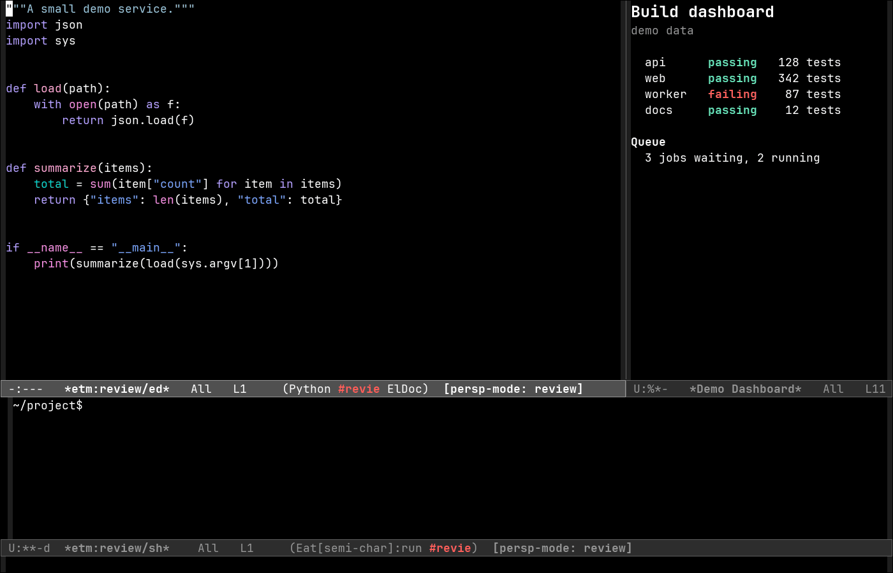

### tab-bar

A workspace is a tab-bar tab.

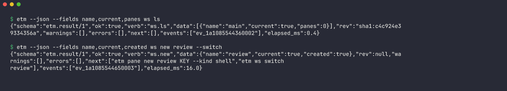


### tabspaces

A workspace is a tab with its own buffer list.

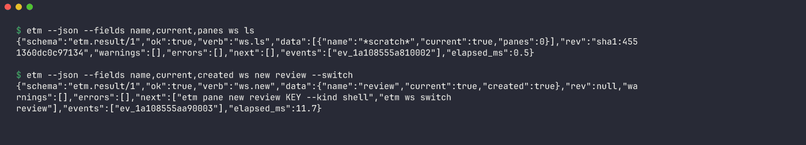
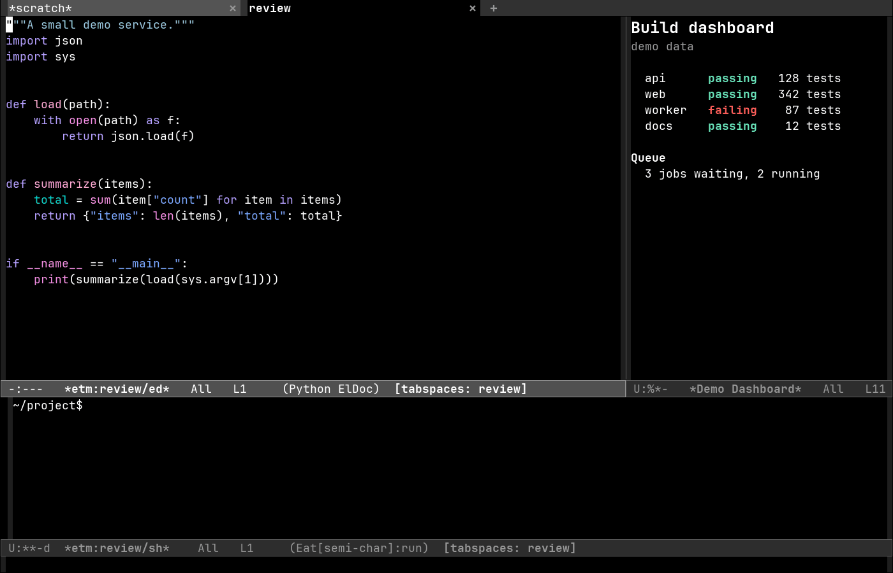

### single

With no workspace mode on there is one `global` workspace; panes work as
everywhere else and `ws new` fails with `capability.unavailable`.

```console
$ etm --json --fields name,current,panes ws ls
$ etm --json ws new review
```

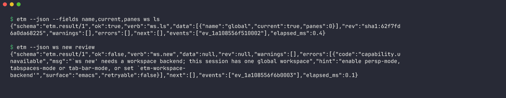
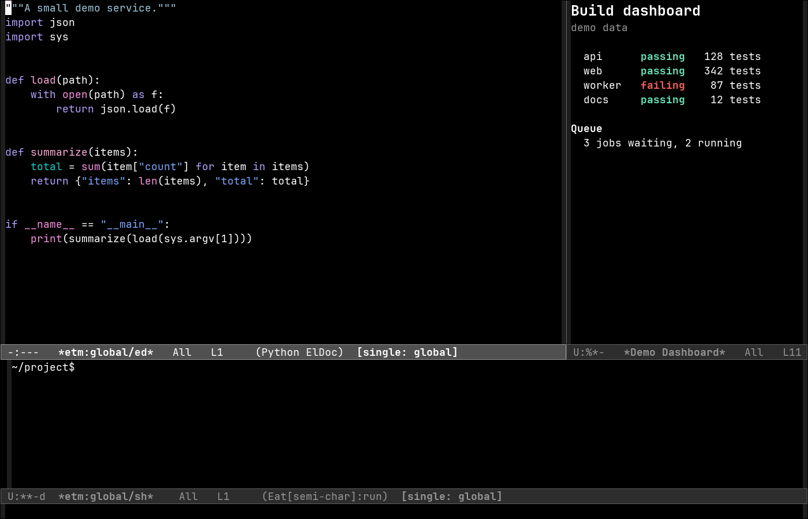

## Output formats

`--robot-format=toon` states a uniform list once, as a header, then one row
per item; `--robot-markdown` renders it as a table. Same call, three views:

```console
$ etm --robot-format=toon --fields addr,kind,region,mode,running pane ls --all
```

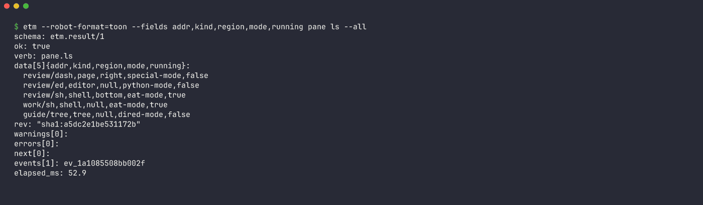

```console
$ etm --robot-markdown --fields addr,kind,region,mode,running pane ls --all
```

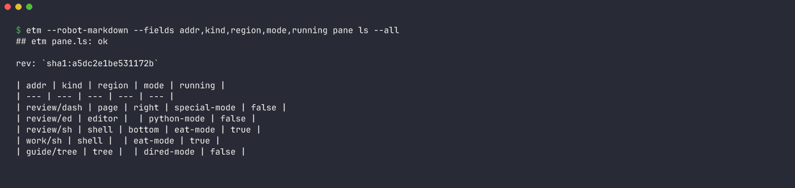

## The manual in Emacs

The manual is an Info manual, `docs/etm.texi`. Once installed it is listed
by `C-h i`:

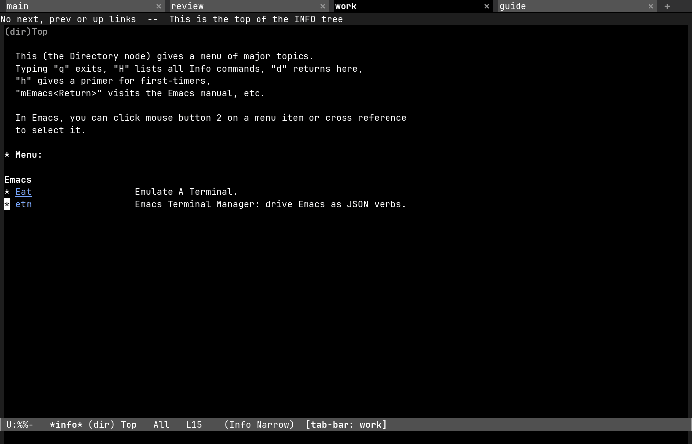

and `C-h i m etm RET` opens it (here at the Quick Start node):


## Help

```console
$ etm --help
```

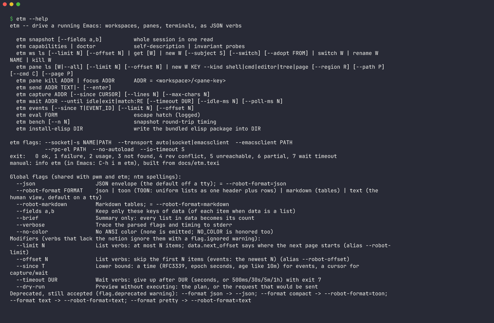

## Regenerating the images

```sh
docs/showcase/make-screenshots.sh              # every image
docs/showcase/make-screenshots.sh --only 'backend-*'
```

It needs an X11 Emacs 29.1+ built with cairo (`emacs-gtk` or `emacs-lucid`),
`Xvfb`, `cargo`, `makeinfo`, the JetBrains Mono font and `pngquant` or
`oxipng`; the header of the script lists the rest. persp-mode, tabspaces and
eat are installed into a throwaway package directory, and freeze is
downloaded when it is not on `PATH`.
